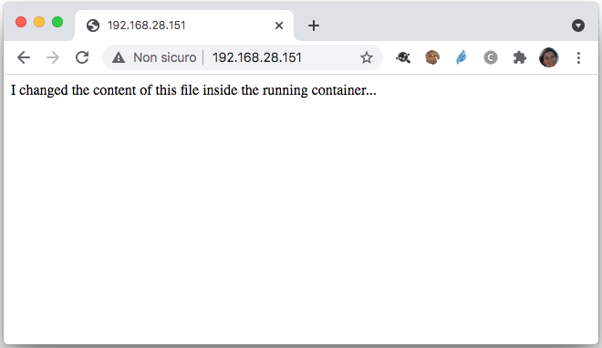

Whenever a running container wants to persist data, it actually put that data into the writable layer through storage driver.

Let's use our `nginx2` container created previously.

!!! tip
    If you don't have this container running you can recreate it with the following command:
    `docker container run -d -p 80:80 --name nginx2 nginx`

Let’s use the `docker exec` command to edit the welcome page and load it.

```bash
docker container exec -it nginx2 bash
```
You should now be inside your container. Run the following command to change the welcome page:

```bash
echo "I changed the content of this file inside the running container..." > /usr/share/nginx/html/index.html
```

You will be able to see these changes connecting to the port 80 of your host:



Let’s restart the container. What happens? We can still see the changes that we made. 

Now..what if we stop this container and start another one and load the page?

```bash
docker container run -d -p 8080:80 --name nginx3 nginx
```
!!! warning
    For this second container you need to specify a different host port, otherwise there will be a conflict and your container will not be started:
 
    `driver failed programming external connectivity on endpoint nginx3 (96fad8e096e1a124147049765f0d734e2a034712fb253711450c62a7158b1f21): Bind for 0.0.0.0:80 failed: port is already allocated.`


Connect to port 8080 of your host, you will see the default welcome page: there is no way that we could access the file that we have changed in another container.


### Using docker volumes

Let's create our first docker volume:

```bash
docker volume create myvol
```

We can list the volumes with:

```bash
docker volume ls
```

```bash
DRIVER    VOLUME NAME
local     myvol
```

We can see the location of volumes in the docker area of the host file system with the inspect command:

```bash
docker volume inspect myvol
```

```bash
[
    {
        "CreatedAt": "2021-06-07T10:53:26Z",
        "Driver": "local",
        "Labels": {},
        "Mountpoint": "/var/lib/docker/volumes/myvol/_data",
        "Name": "myvol",
        "Options": {},
        "Scope": "local"
    }
]
```

Let's re-create our `nginx` container with the following command that mounts the volume `myvol` in `/usr/share/nginx/html`:

Remove the old container
```bash
docker container rm -f nginx3
```

Recreate it with the volume mounted:
```bash
docker container run -d -p 8080:80 --name nginx3 --mount source=myvol,destination=/usr/share/nginx/html nginx
```


