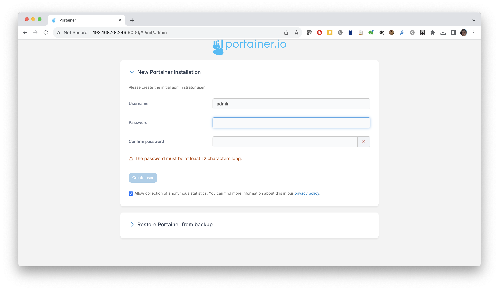
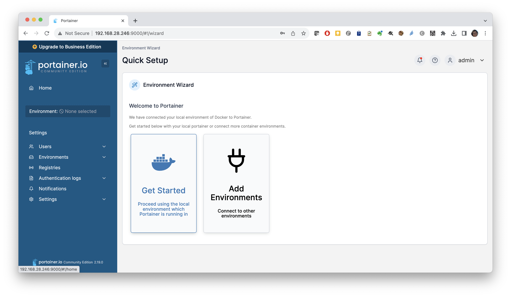
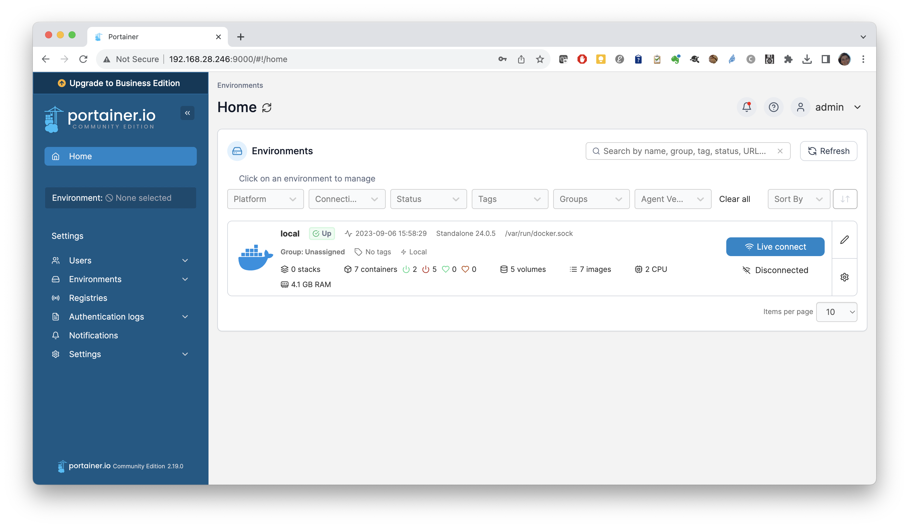
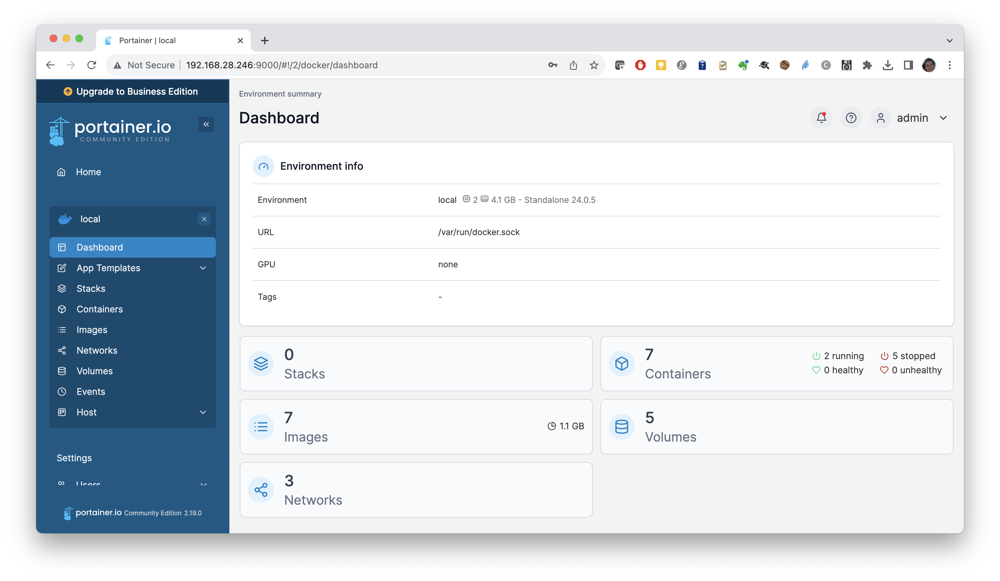
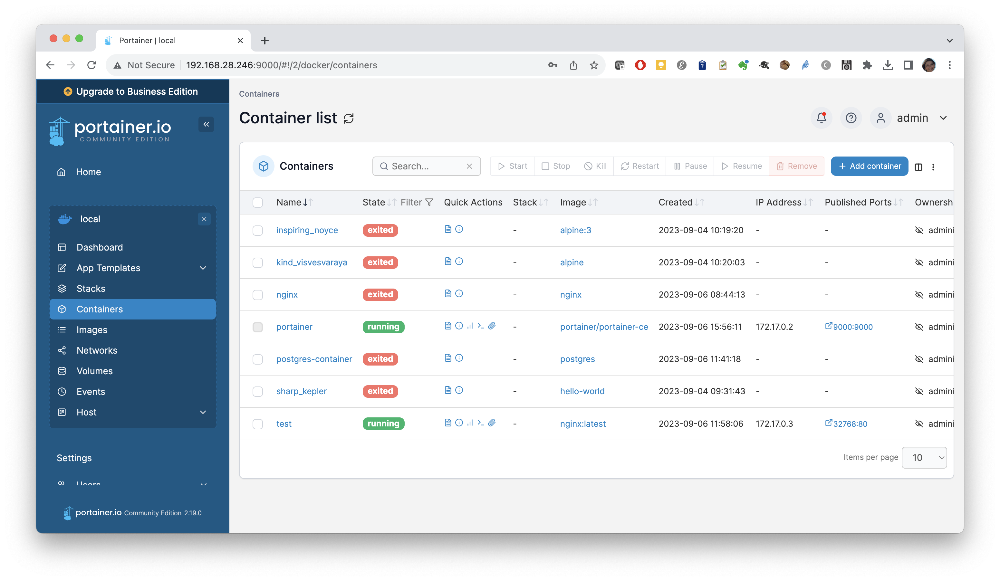
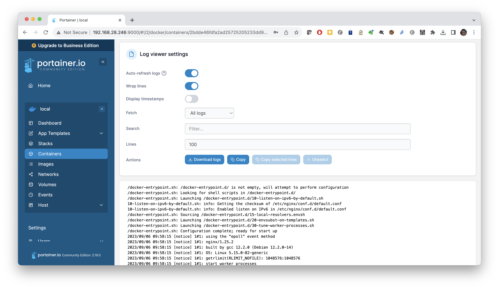
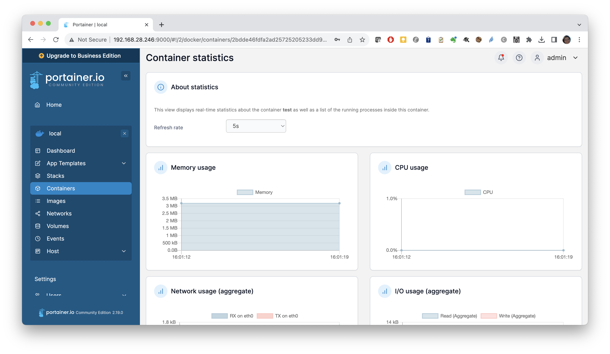

Portainer is a lightweight management UI which allows you to easily manage your different Docker environments (Docker hosts or Swarm clusters).
Portainer is meant to be as simple to deploy as it is to use. It consists of a single container that can run on any Docker engine.

## Installation

```bash
docker volume create portainer_data
```

```bash
docker run -d -p 9000:9000 --name=portainer --restart=always -v /var/run/docker.sock:/var/run/docker.sock -v portainer_data:/data portainer/portainer-ce
```

## Usage

The UI will be exposed on port `9000` and you will be asked to create the initial administrator setting a password:



Then choose to manage the local Docker environment clicking on `Get Started`:



If everything works as expected, you will then be shown the Portainer home page. Click on the `local` environment:



In the menu, clicking on `Dashboard` will open a summary view of your docker engine:



Clicking on `Containers` will allow you to manage containers:



Then click on one running container to get the container status and menu from which you can see the log and statistics: 





!!! question "Exercise"
    Now go back to the `Containers` page and try to add a new container. 
