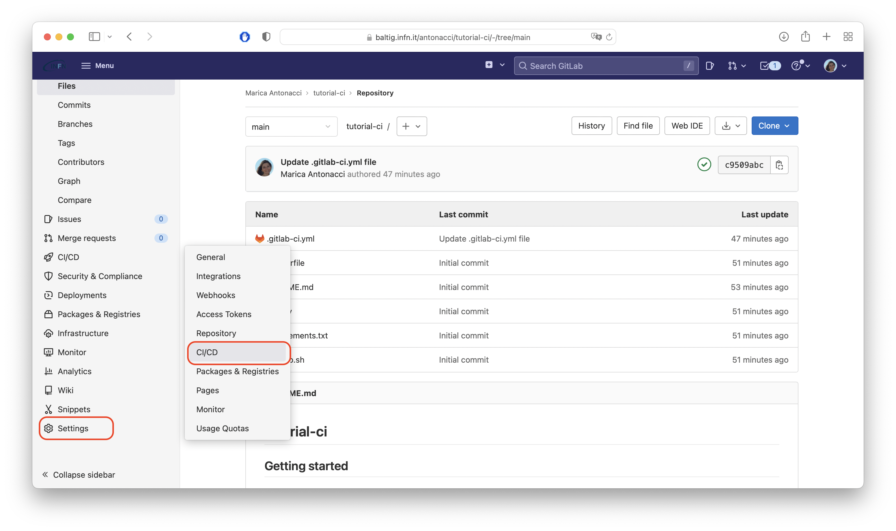
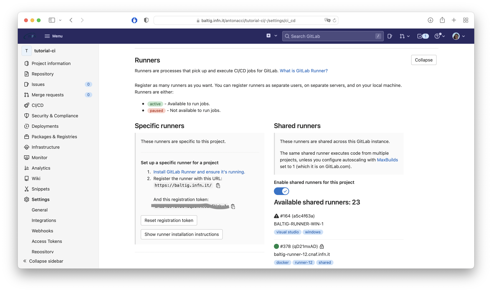
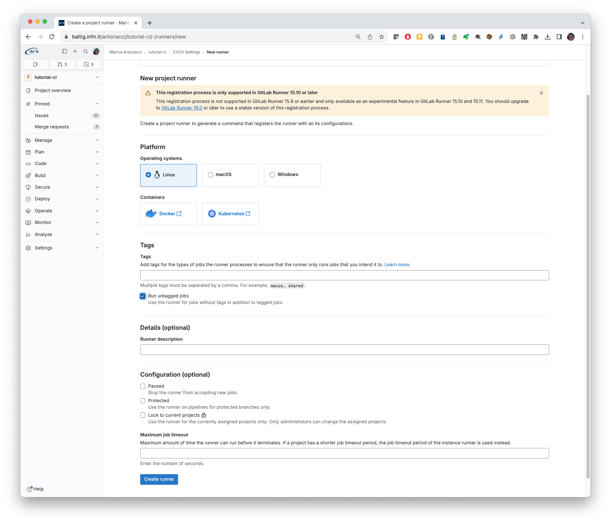
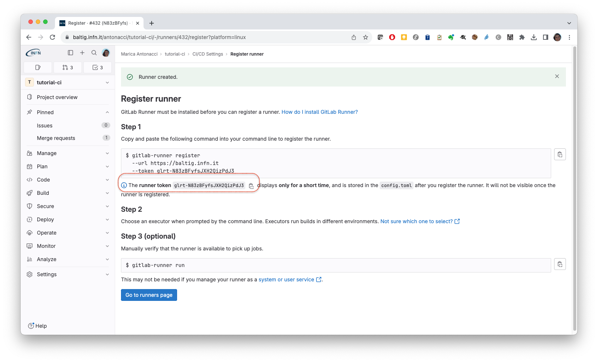
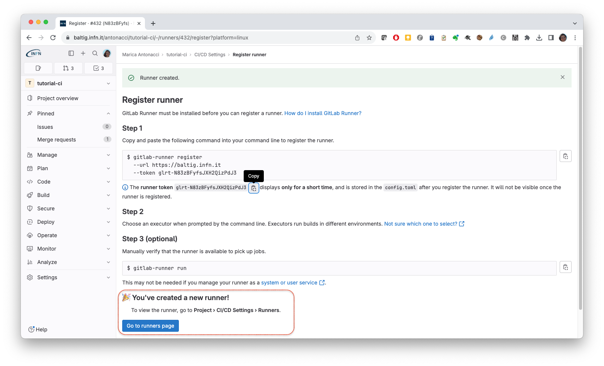
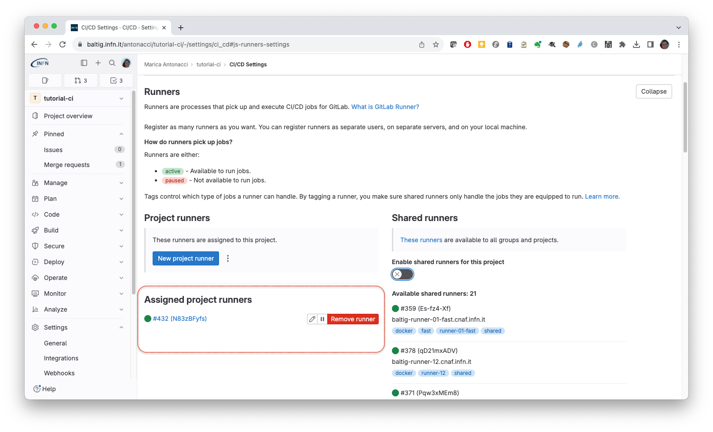
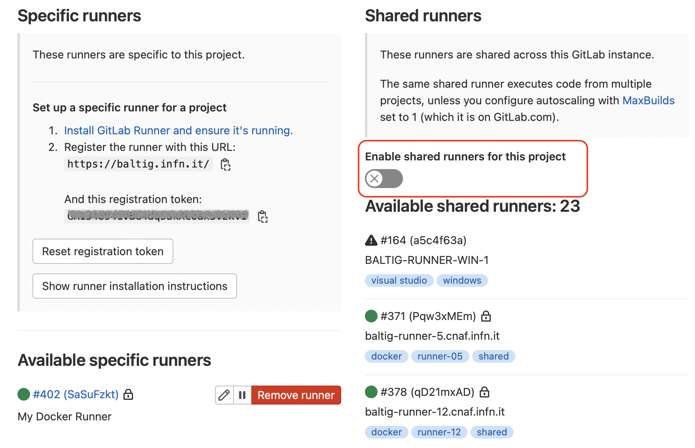
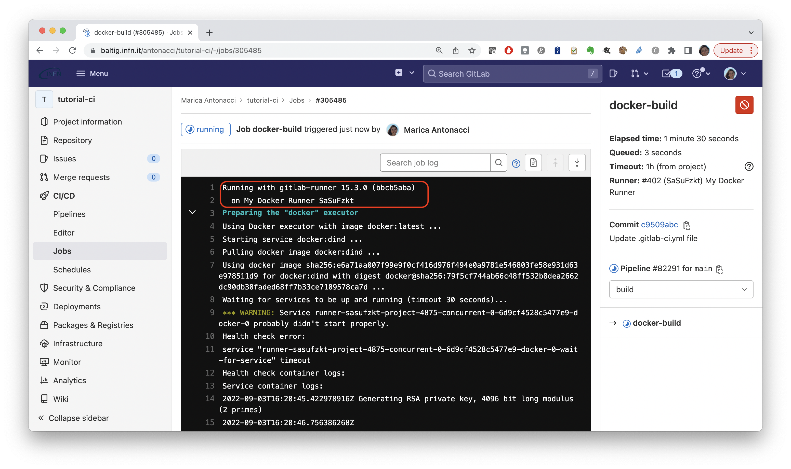

In this section we will add a dedicated GitLab runner to the CI/CD infrastructure. The runner will execute inside a docker container.

1. Create the docker volume:
   ````
   docker volume create gitlab-runner-config
   ````
2. Start the GitLab runner container using the volume we have just created:
   ````
   docker run -d --name gitlab-runner --restart always \
   -v /var/run/docker.sock:/var/run/docker.sock \
   -v gitlab-runner-config:/etc/gitlab-runner \
   gitlab/gitlab-runner:latest 
   ````
   Check your container is running:
   ```
   docker ps
   CONTAINER ID   IMAGE                         COMMAND                  CREATED         STATUS         PORTS     NAMES
   94f0a1bdc4de   gitlab/gitlab-runner:latest   "/usr/bin/dumb-init …"   6 minutes ago   Up 5 minutes             gitlab-runner
   ```

3. Register the runner
       1. Obtain a token:
          Visit your project web page (at `https://baltig.infn.it/USERNAME/tutorial-ci`) and go to **Settings > CI/CD** and expand the **Runners** section:
          
          Click "New project runner" under the section *Project runners*:
          
          Select the option "Run untagged jobs" as shown in the next figure:
          
          Copy the token displayed in step 1:
          
       2. Launch the following command replacing the `***********` with the token you have just copied:
          ```
          docker exec -it gitlab-runner gitlab-runner register -n --url https://baltig.infn.it \
          --token *********** --description "My Docker Runner" \
          --executor docker --docker-image "docker:latest" \
          --docker-volumes /var/run/docker.sock:/var/run/docker.sock
          ```
          If the registration is successful you will get a similar message:
          ```
          Runtime platform                                    arch=amd64 os=linux pid=16 revision=8ec04662 version=16.3.0
          Running in system-mode.
          
          Verifying runner... is valid                        runner=5sYMm3yvH
          Runner registered successfully. Feel free to start it, but if it's running already the config should be automatically reloaded!
          
          Configuration (with the authentication token) was saved in "/etc/gitlab-runner/config.toml"
          ```
          You will see the message about the successful registration also in the web page:
          
          and your runner will appear under the specific runners of the project:
          

Now you can disable the shared runners and use your newly created one:


Let's trigger our pipeline. You can commit a change in your repository or trigger it manually from **CI/CD > Pipelines**:



You can also look at the runner logs using the command `docker logs gitlab-runner`:

```
docker logs -f gitlab-runner
Runtime platform                                    arch=amd64 os=linux pid=7 revision=8ec04662 version=16.3.0
Starting multi-runner from /etc/gitlab-runner/config.toml...  builds=0 max_builds=0
Running in system-mode.

Created missing unique system ID                    system_id=r_P8aAkaba4WdQ
Configuration loaded                                builds=0 max_builds=1
listen_address not defined, metrics & debug endpoints disabled  builds=0 max_builds=1
[session_server].listen_address not defined, session endpoints disabled  builds=0 max_builds=1
Initializing executor providers                     builds=0 max_builds=1
Checking for jobs... received                       job=399659 repo_url=https://baltig.infn.it/antonacci/tutorial-ci.git runner=N83zBFyfs
Added job to processing list                        builds=1 job=399659 max_builds=1 project=4884 repo_url=https://baltig.infn.it/antonacci/tutorial-ci.git
Appending trace to coordinator...ok                 code=202 job=399659 job-log=0-281 job-status=running runner=N83zBFyfs sent-log=0-280 status=202 Accepted update-interval=3s
Appending trace to coordinator...ok                 code=202 job=399659 job-log=0-369 job-status=running runner=N83zBFyfs sent-log=281-368 status=202 Accepted update-interval=3s
Appending trace to coordinator...ok                 code=202 job=399659 job-log=0-580 job-status=running runner=N83zBFyfs sent-log=369-579 status=202 Accepted update-interval=3s
Appending trace to coordinator...ok                 code=202 job=399659 job-log=0-655 job-status=running runner=N83zBFyfs sent-log=580-654 status=202 Accepted update-interval=3s
Appending trace to coordinator...ok                 code=202 job=399659 job-log=0-2246 job-status=running runner=N83zBFyfs sent-log=655-2245 status=202 Accepted update-interval=3s
Appending trace to coordinator...ok                 code=202 job=399659 job-log=0-2590 job-status=running runner=N83zBFyfs sent-log=2246-2589 status=202 Accepted update-interval=3s
Appending trace to coordinator...ok                 code=202 job=399659 job-log=0-2664 job-status=running runner=N83zBFyfs sent-log=2590-2663 status=202 Accepted update-interval=3s
Appending trace to coordinator...ok                 code=202 job=399659 job-log=0-2803 job-status=running runner=N83zBFyfs sent-log=2664-2802 status=202 Accepted update-interval=3s
Appending trace to coordinator...ok                 code=202 job=399659 job-log=0-3081 job-status=running runner=N83zBFyfs sent-log=2803-3080 status=202 Accepted update-interval=3s
Appending trace to coordinator...ok                 code=202 job=399659 job-log=0-3443 job-status=running runner=N83zBFyfs sent-log=3081-3442 status=202 Accepted update-interval=3s
Appending trace to coordinator...ok                 code=202 job=399659 job-log=0-4295 job-status=running runner=N83zBFyfs sent-log=3443-4294 status=202 Accepted update-interval=3s
Appending trace to coordinator...ok                 code=202 job=399659 job-log=0-4333 job-status=running runner=N83zBFyfs sent-log=4295-4332 status=202 Accepted update-interval=3s
Appending trace to coordinator...ok                 code=202 job=399659 job-log=0-4413 job-status=running runner=N83zBFyfs sent-log=4333-4412 status=202 Accepted update-interval=3s
Appending trace to coordinator...ok                 code=202 job=399659 job-log=0-4500 job-status=running runner=N83zBFyfs sent-log=4413-4499 status=202 Accepted update-interval=3s
Appending trace to coordinator...ok                 code=202 job=399659 job-log=0-4724 job-status=running runner=N83zBFyfs sent-log=4500-4723 status=202 Accepted update-interval=3s
Appending trace to coordinator...ok                 code=202 job=399659 job-log=0-5595 job-status=running runner=N83zBFyfs sent-log=4724-5594 status=202 Accepted update-interval=3s
Appending trace to coordinator...ok                 code=202 job=399659 job-log=0-6264 job-status=running runner=N83zBFyfs sent-log=5595-6263 status=202 Accepted update-interval=3s
Appending trace to coordinator...ok                 code=202 job=399659 job-log=0-6334 job-status=running runner=N83zBFyfs sent-log=6264-6333 status=202 Accepted update-interval=3s
Appending trace to coordinator...ok                 code=202 job=399659 job-log=0-6439 job-status=running runner=N83zBFyfs sent-log=6334-6438 status=202 Accepted update-interval=3s
Appending trace to coordinator...ok                 code=202 job=399659 job-log=0-6579 job-status=running runner=N83zBFyfs sent-log=6439-6578 status=202 Accepted update-interval=3s
Appending trace to coordinator...ok                 code=202 job=399659 job-log=0-6818 job-status=running runner=N83zBFyfs sent-log=6579-6817 status=202 Accepted update-interval=3s
Appending trace to coordinator...ok                 code=202 job=399659 job-log=0-6985 job-status=running runner=N83zBFyfs sent-log=6818-6984 status=202 Accepted update-interval=3s
Job succeeded                                       duration_s=144.960209393 job=399659 project=4884 runner=N83zBFyfs
Appending trace to coordinator...ok                 code=202 job=399659 job-log=0-7061 job-status=running runner=N83zBFyfs sent-log=6985-7060 status=202 Accepted update-interval=3s
Updating job...                                     bytesize=7061 checksum=crc32:77dc11c0 job=399659 runner=N83zBFyfs
Submitting job to coordinator...ok                  bytesize=7061 checksum=crc32:77dc11c0 code=200 job=399659 job-status= runner=N83zBFyfs update-interval=0s
Removed job from processing list                    builds=0 job=399659 max_builds=1 project=4884 repo_url=https://baltig.infn.it/antonacci/tutorial-ci.git
```  
           
