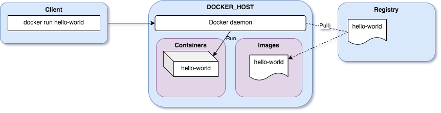

Let's create our first docker container:

=== "Command"
  ```bash
  docker container run hello-world
  ```
Look at the output:

```bash
Unable to find image 'hello-world:latest' locally
latest: Pulling from library/hello-world
719385e32844: Pull complete
Digest: sha256:dcba6daec718f547568c562956fa47e1b03673dd010fe6ee58ca806767031d1c
Status: Downloaded newer image for hello-world:latest

Hello from Docker!
This message shows that your installation appears to be working correctly.

To generate this message, Docker took the following steps:
 1. The Docker client contacted the Docker daemon.
 2. The Docker daemon pulled the "hello-world" image from the Docker Hub.
    (amd64)
 3. The Docker daemon created a new container from that image which runs the
    executable that produces the output you are currently reading.
 4. The Docker daemon streamed that output to the Docker client, which sent it
    to your terminal.

To try something more ambitious, you can run an Ubuntu container with:
 $ docker run -it ubuntu bash

Share images, automate workflows, and more with a free Docker ID:
 https://hub.docker.com/

For more examples and ideas, visit:
 https://docs.docker.com/get-started/
```

Let's see what happened behind the scene...



You launched the command `docker run hello-world` where `hello-world` is the name of a docker image.

The Docker client reached out to the daemon, telling it to get the hello-world image and run a container from that.

The Docker daemon looked for the image within your local repository and realized that it's not there: `Unable to find image 'hello-world:latest' locally`.

The daemon then contacted the default public registry which is [Docker Hub](https://hub.docker.com/){:target="_blank"} and pulled in the latest copy of the `hello-world` image: `Pulling from library/hello-world`.

The Docker daemon then created a new container from the freshly pulled image.

Finally the Docker daemon ran the container created using the hello-world image.

Hello World only function is to output the text you see in the terminal, after which the container exits.


You can use the command `docker container ps` to list the running containers (use `-a` option to list all the stopped containers):
```bash
docker container ps -a
```

You will find the container just started and run from the `hello-world` image:
```bash
CONTAINER ID   IMAGE         COMMAND    CREATED              STATUS                          PORTS     NAMES
c0ba7d45168a   hello-world   "/hello"   About a minute ago   Exited (0) About a minute ago             thirsty_poitras
```

!!! note 
    When we create a container, if we don't give a specific name, Docker will pick one for us.
    
    It will be the concatenation of:

    - A mood (furious, goofy, suspicious, boring...)
    - The name of a famous inventor (tesla, darwin, wozniak...)

    Examples: `happy_curie`, `jovial_lovelace` ...

